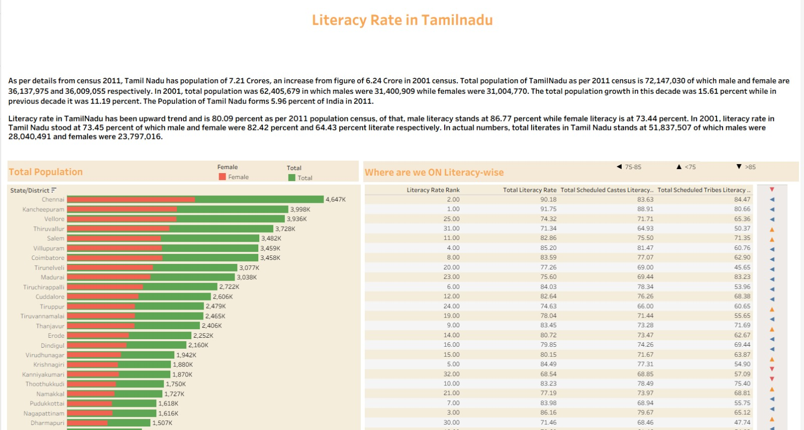
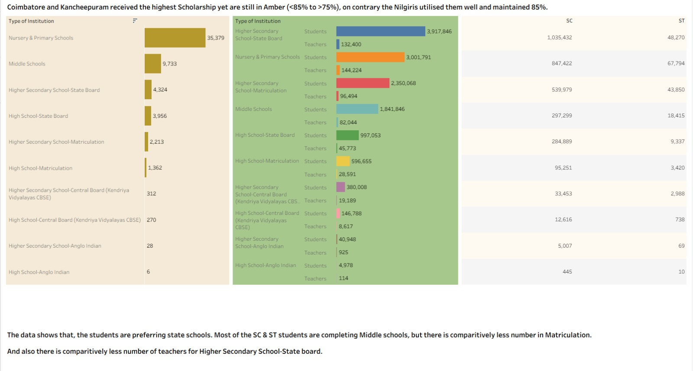

📊 Literacy Rate in Tamil Nadu — Data Visualization Dashboard
📌 Project Overview

This project focuses on building an interactive Tableau dashboard that enables mission-driven organizations to leverage data visualization for social impact. The dataset analyzes literacy rates across cities in Tamil Nadu, highlighting demographic distribution, gender-based population insights, institutional availability, and scholarship beneficiaries. 

The dashboard is designed to present complex social data in an article-style layout, helping viewers quickly understand the state of literacy and identify key areas that require attention. 

---

🎯 Objectives

Analyze literacy rates across different cities in Tamil Nadu.

Compare female population against the total population.

Visualize city rankings based on literacy metrics.

Highlight scholarship/beneficiary distribution.

Display the number of institutions and teachers available.

Present insights in a structured, article-like dashboard format. 

---

🧰 Tools & Technologies

Tableau – Data visualization and dashboard creation

Dataset – Literacy statistics categorized by city, gender population, institutions, and beneficiaries

---

📈 Dashboard Features

Interactive charts for literacy comparison

Gender-based population visualization

City-wise ranking insights

Institutional and teacher availability metrics

Scholarship distribution overview

Combination of tiled and floating sheets for better storytelling and layout. 

---

🏗️ Project Structure
Literacy-Rate-Tamil-Nadu/
│
├── Data
├── Reprsentation
├── Literacy Rate in Tamil Nadu Analysis.twbx   # Tableau packaged workbook
├── Problem statement.txt                      # Project requirements
└── README.md

---

▶️ How to Use

Download the .twbx file from this repository.

Open it using Tableau Desktop or Tableau Reader.

Explore the dashboard using filters and interactive elements to gain insights.

📊 Business Requirement

Title: Literacy Rate in Tamilnadu
The dashboard recreates the specified design while focusing on predicting and presenting fundamental social issues through effective visualization. 

---

🚀 Outcomes

This dashboard helps stakeholders:

Understand literacy distribution across Tamil Nadu

Identify gender gaps in education

Evaluate resource allocation such as teachers and institutions

Support data-driven decisions for educational development

---

📸 Dashboard Preview

---

🔮 Future Enhancements

Add yearly trend analysis

Integrate predictive analytics

Publish the dashboard to Tableau Public for wider accessibility

Enhance interactivity with advanced filters
---

👤 Author

Suraj Singh
Data Visualization Enthusiast